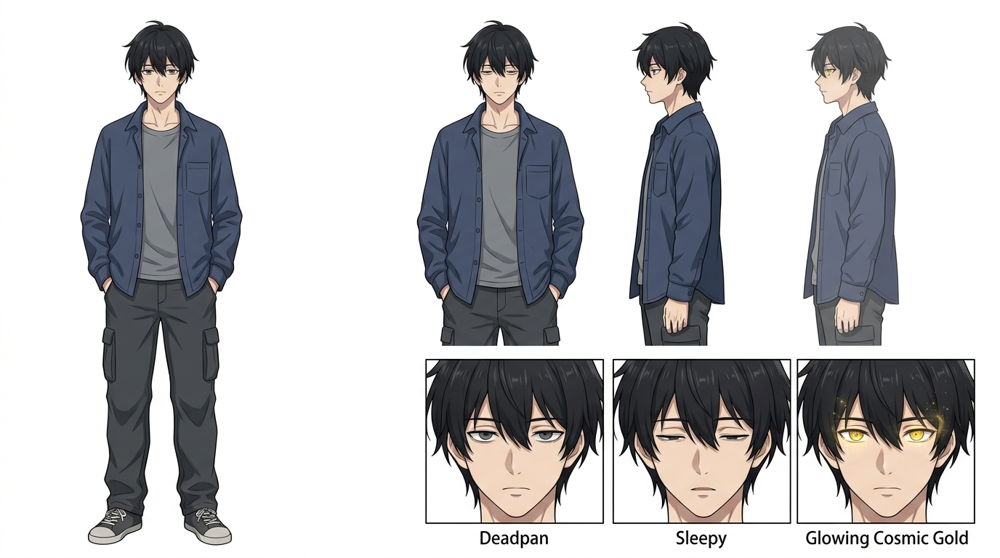
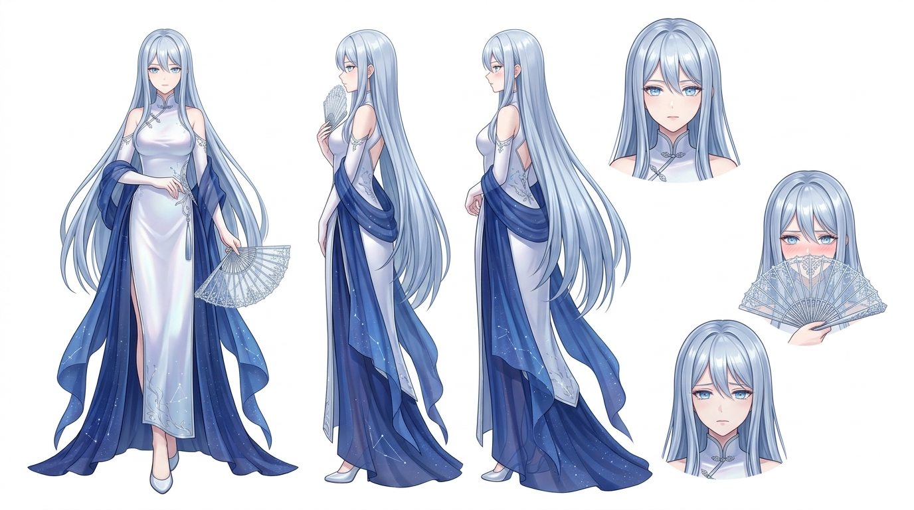

# Character Art Direction & Visual Guide (Hyper-Detailed)

Dokumen ini adalah referensi visual tingkat lanjut (*Hyper-detailed Art Direction*) bagi Illustrator, Animator, atau 3D Modeler untuk memastikan presisi anatomi, pakaian, dan konsistensi karakter Aeterna dan Lysthea.

---

## 1. AETERNA (The Prime Deity / The Lazy Logician)

**A. Spesifikasi Fisik (Physical Spec)**
* **Tinggi Badan (Height):** 178 cm. (Tinggi rata-rata seorang pria, sengaja agar mudah membaur di keramaian).
* **Berat Badan (Weight):** 70 kg.
* **Tipe Tubuh (Build):** *Lean and casual*. Tidak berotot tebal seperti prajurit, tapi memiliki proporsi bahu dan dada yang bidang secara natural (bawaan dari wadah reinkarnasinya). Karena posturnya yang sering *slouching* (sedikit membungkuk karena malas), dia dari luar terlihat lebih pendek atau kurang bertenaga dari aslinya.
* **Gaya Berjalan (Gait):** Lambat, sangat rileks, dengan tangan sering bersarang di dalam saku celana. Langkah kakinya secara aneh tidak pernah menghasilkan suara berisik (karena dia secara matematis mengkalkulasi dan meniadakan friksi suara di sekitarnya tanpa sadar).

**B. Desain Kepala & Wajah**
* **Struktur Wajah:** Rahang tegas tapi tidak kaku, bentuk wajah sedikit oval. Penampilannya *average good-looking* (tampan tapi tidak mencolok).
* **Rambut (Hair):** 
  * **Panjang:** Sedang (menutupi sebagian telinga, poni jatuh hingga sedikit melewati alis mata).
  * **Gaya:** *Natural & Casual*. Tidak terlalu acak-acakan seperti baru bangun tidur, tapi juga tidak disisir klimis. Terlihat natural, santai, dengan poni yang jatuh alami.
  * **Warna:** Hitam pekat (*Onyx Black*) dengan sedikit pendaran warna kebiruan sangat tua jika terkena cahaya matahari langsung.
* **Mata (Eyes):**
  * **Bentuk:** *Dead fish eyes* (kelopak mata atas agak turun, memberikan kesan mengantuk permanen). Sorot matanya tajam namun kosong dari antusiasme.
  * **Warna Iris:** Abu-abu gelap (*Charcoal Grey*). Saat kekuatan aslinya terpicu, iris matanya menyala menjadi **Cosmic Gold** dengan pupil yang menyipit tipis selama sedetik sebelum kembali normal.

**C. Pakaian & Aksesori (Ultra-Casual Daily Wear)**
* **Atasan:** Kaus polos berbahan katun lembut (abu-abu terang atau hitam pudar). Di bagian luarnya, ia mengenakan kemeja flanel longgar berbahan jatuh, atau jaket *windbreaker* tipis berwarna *navy blue* pudar yang **tidak pernah dikancingkan**. Lengan kemeja ditarik sembarangan ke bawah siku.
* **Bawahan:** Celana *Cargo* atau *Jogger* berbahan kanvas lembut berwarna gelap (cokelat tanah pudar atau *dark olive*). Memiliki banyak saku besar fungsional.
* **Sepatu:** *Sneakers* kasual atau sepatu bot pergelangan kaki (*ankle boots*) dengan sol empuk (karena dia benci kakinya pegal).
* **Detail Tangan & Prop:** 
  * **Tangan:** Jari-jarinya ramping, panjang, dan sangat presisi (tangan tipikal seorang pembuat jam tangan / *Rune Coder* level tinggi). 
  * **Rune Stylus:** Sebuah logam kusam menyerupai obeng kecil / pena ukir yang diselipkan sembarangan di saku dada atau celananya. Ini sebenarnya adalah Artefak Akses Root (Sihir) yang disamarkan.
  * **Aksesori:** Sering memakai jam tangan kulit usang di pergelangan tangan kirinya.

---

## 2. LYSTHEA (The Goddess of Order / The Cool Beauty)

**A. Spesifikasi Fisik (Physical Spec)**
* **Tinggi Badan (Height):** 165 cm (sekitar 170 cm jika sedang memakai sepatu hak tingginya).
* **Berat Badan (Weight):** 52 kg.
* **Tipe Tubuh (Build):** Sangat ramping (*Slender*), tinggi semampai, elegan, dengan lekuk tubuh dewasa yang halus namun tersamarkan oleh gaun sucinya.
* **Gaya Berjalan (Gait):** *Gliding*. Dia berjalan seolah-olah mengambang beberapa milimeter di atas lantai. Punggung tegak lurus sempurna, tanpa ada ayunan bahu berlebih. Auranya selalu mendinginkan suhu ruangan.

**B. Desain Kepala & Wajah**
* **Struktur Wajah:** Proporsi simetris yang absolut (*Golden Ratio*). Kulitnya sepucat porselen tanpa noda (*Flawless*). Hidungnya mancung tipis, dan bibirnya kecil namun penuh (berwarna *soft peach*).
* **Rambut (Hair):**
  * **Panjang:** Sangat panjang hingga mencapai punggung bagian bawah.
  * **Gaya:** Lurus jatuh mengalir bagai air (*Silky straight*). Di mode publik, separuh rambutnya diikat elegan ke atas menggunakan jepit perak berlambang rasi bintang. Di mode privat (saat bersama Aeterna), jepitan itu dilepas dan dibiarkan tergerai bebas sedikit menutupi bahunya.
  * **Warna:** Biru keperakan (*Silvery-Blue* atau *Starlight Indigo*). Jika diamati di ruangan gelap, rambutnya memancarkan pendaran cahaya magis (*glow*) yang sangat tipis.
* **Mata (Eyes):**
  * **Bentuk:** Ujung matanya sedikit runcing dan menyipit (*Elegant/Melancholic cat-eyes*), memberikan kesan dingin dan tak tersentuh.
  * **Warna Iris:** Biru Kristal yang sangat terang (*Luminous Ice Blue*). Matanya seperti menyimpan lautan galaksi yang dalam.

**C. Pakaian & Aksesori (The Holy Vestments - Modern Fantasy)**
* **Atasan & Gaun:** Mengenakan *A-line maxi dress* yang pas di badan (*form-fitting* di area dada dan pinggang) dengan kerah menutupi leher (*high-collar*). Warna dasarnya putih mutiara (*Pearlescent White*) yang dilapisi luaran kain *chiffon* atau sutra melayang berwarna *Deep Cosmic Blue*.
* **Aksen Desain:** Bukan jubah kuno yang berat. Di sepanjang ujung gaun atau lengan panjangnya, terdapat motif garis perak yang menyerupai sirkuit data magis / jaring rasi bintang.
* **Sepatu:** Sepatu hak tinggi (sekitar 5 cm) berwarna perak, yang dilapisi sihir peredam suara (tidak pernah berbunyi *klik-klak* saat berjalan).
* **Detail Tangan & Prop Utama:**
  * **Kipas Lipat Perak (*Silver Folding Fan*):** Aksesori wajib dan ciri khas utamanya. Rangkanya terbuat dari logam *Aether*, dan kain kipasnya semi-transparan. Lysthea selalu menggunakannya untuk menutupi separuh wajah bawahnya secara elegan saat sedang menyembunyikan wajahnya yang merona, sedang cemberut (*soft tsundere pout*), atau saat tersenyum tipis merespon Aeterna.
